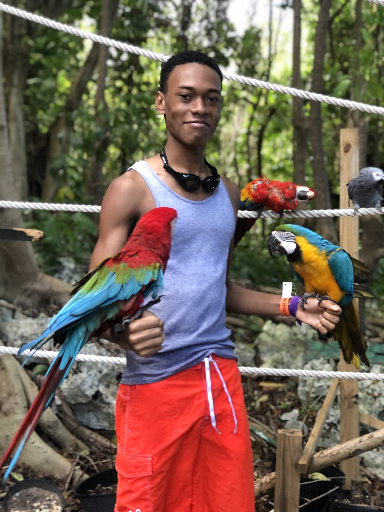

### HI IM NATHANIEL

### MY PROJECTS
https://seaforth-inventory.herokuapp.com/
- A inventory management system built for the COG7TH Seaforth using PHP and MYSQL.

### UNDERGRADUATE GROUP PROJECT
https://uwi-ar-maps.herokuapp.com/
- AR Navgigation of the Faculty of Science and Technology built with AR.js

🌱 I’m currently learning everything
<!--
**bedassie-n/bedassie-n** is a ✨ _special_ ✨ repository because its `README.md` (this file) appears on your GitHub profile.

Here are some ideas to get you started:

- 🔭 I’m currently working on ...
- 🌱 I’m currently learning ...
- 👯 I’m looking to collaborate on ...
- 🤔 I’m looking for help with ...
- 💬 Ask me about ...
- 📫 How to reach me: ...
- 😄 Pronouns: ...
- ⚡ Fun fact: ...
-->
